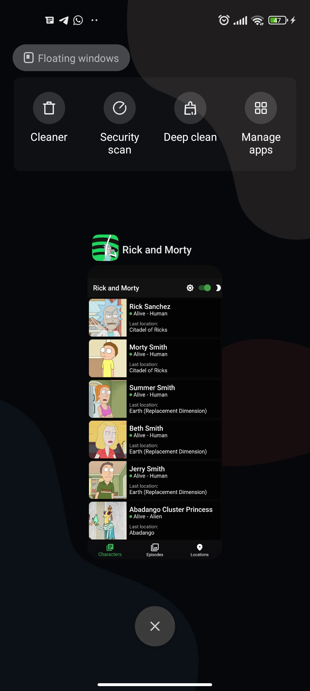

# Rick and Morty

[](https://flutter.dev/docs/development/tools/sdk/releases)
[](https://github.com/tenhobi/effective_dart)
[](https://opensource.org/licenses/MIT)

A simple app to demonstrate auto_route and flutter_bloc.

  __NOTE: If you have a recent Flutter version, I strongly recommend to use [Flutter version manager (fvm)](https://fvm.app/es/) to change Flutter version and avoid some issues. Flutter v2.5.0 and dart v2.14.0__

## Screenshots

<p>


</p>

### Dark mode

<p>

</p>

### Theme for every screen (Mobile, Tablet, Desktop)

<p>


</p>

## Navigation 2.0


## Icons
### For Android and iOS
For mobile platforms, I used [Flutter launcher icons](https://pub.dev/packages/flutter_launcher_icons).
<p>

</p>

### For Web
In order to generate different icon sizes, I used [Favicon generator](https://favicon.io/).
<p>

</p>

### For Windows
I don't use Windows sorry, but in theory it works, I changed the .ico in `indows/runner/resources/app_icon.ico`.

### For Linux
In Linux, it will depend on the package manager that you use, so there is nothing to do in Flutter.


## Installation

- Check if you are in the stable channel of flutter SDK version v2.5.0 and the dart version v2.14.0. [Instruction to change flutter channel](https://github.com/flutter/flutter/wiki/Flutter-build-release-channels#how-to-change-channels). 
  
  __NOTE: If you have a recent version, I strongly recommend to use [Flutter version manager (fvm)](https://fvm.app/es/) to change Flutter version and avoid some issues.__
- Clone the repo
  ```sh
  git clone https://github.com/oscarnar/rick_and_morty.git
  ```
- And then we can use the normal build and run procedure
  ```sh
  flutter pub get
  flutter run
  ```
## Getting Started

This project is a starting point for a Flutter application.

A few resources to get you started if this is your first Flutter project:

- [Lab: Write your first Flutter app](https://flutter.dev/docs/get-started/codelab)
- [Cookbook: Useful Flutter samples](https://flutter.dev/docs/cookbook)

For help getting started with Flutter, view our
[online documentation](https://flutter.dev/docs), which offers tutorials,
samples, guidance on mobile development, and a full API reference.

### See you
